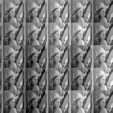
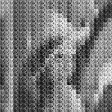
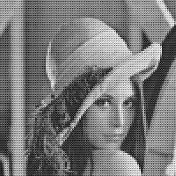

# COLLAGE

Stitching Little Images Into Larger Images

**Instructions**:

* **Setting Executable Bit**: eg. `$chmod +x collage.py`
* **Browsing Usage**: eg. `./collage.py -h`
* **Converting Output Images to Video**: eg. `ffmpeg -r 25 -i output/frame-%05d.jpg -c:v libx264 -vf fps=25 -pix_fmt yuv420p out.mp4`

**Examples**:

Here are some examples:

Lena

Some More Lena

Even More Lena

A Lot of Lena

**Notes**:

* Requires python.
* Requires pyopencv.
* Requires ffmpeg.
